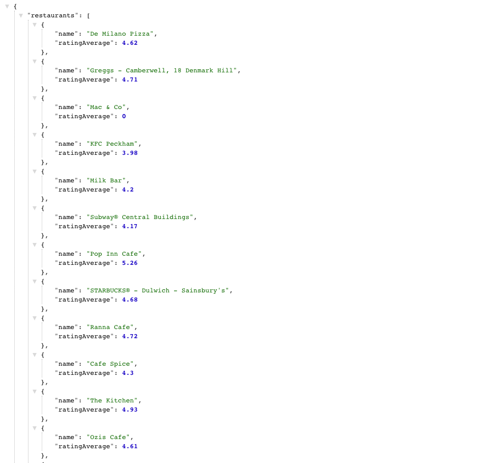

# Just Eat Restaurant Finder

A simple application that generates local restaurants when the user inputs a postcode.

### Stack
- Go on the backend/server
- Vanilla Javascript on the Front-end (Still in progress ⌛️)
- HTML static page

### Requirements
- [Go](https://golang.org/doc/install)
- [Just Eat API](https://uk.api.just-eat.io/restaurants/bypostcode/)

### Setting up your Environment
#### Clone:
- `git clone git@github.com:rhc07/just-eat-api.git`

**OR**

- `git clone https://github.com/rhc07/just-eat-api.git`

#### Download Dependencies:
- `go mod tidy`
- `go mod vendor`

### Build and Run

#### Build:
- `go build`

#### Run:
- `./main`
- Type in a postcode after seeing this command in the termainal: `Enter your postcode:`

#### Visit:
- [Local Host](http://localhost:8080/)
- Your local host link should look something like this:

##### UI (Not finished⌛):
- You can also see these restaurants on the UI after re-submitting your postcode on the form. Form can't send POST requests yet, so you cannot use it dynamically:
- https://user-images.githubusercontent.com/76108704/159246045-9eb229f3-8edf-4fa0-8419-3b7c308522e4.mov

#### Tests:
- `go test`
