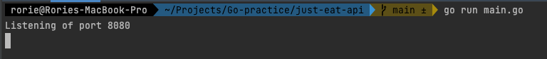

# Just Eat Restaurant Finder

A simple application that generates local restaurants when the user inputs a postcode.

### Stack
- Go on the backend/server
- Vanilla Javascript on the Front-end
- HTML static page

### Requirements
- [Go](https://golang.org/doc/install)
- [Just Eat API](https://uk.api.just-eat.io/restaurants/bypostcode/)

### Setting up your Environment
#### Clone:
- `git clone git@github.com:rhc07/just-eat-api.git`

**OR**

- `git clone https://github.com/rhc07/just-eat-api.git`

#### Download Dependencies:
- `go mod tidy`
- `go mod vendor`

### Build and Run

#### Build & Run:
- `go build`
- `./main`

**OR**

- `go run main.go`

You should see the following in your terminal:

#### Visit:
- Once the server is running successfully, open your `index.html` file in your browser.
- Type in a postcode and wait for your restaurants to appear.

https://user-images.githubusercontent.com/76108704/159351587-c6c9b84f-3f54-4339-bac5-c63b9fcd5f85.mov

#### Tests:
- `go test`
